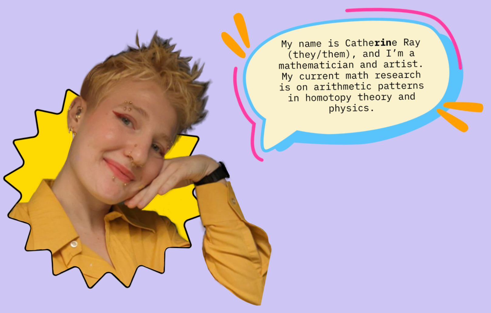
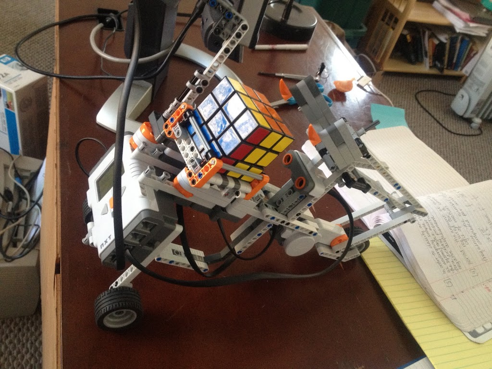
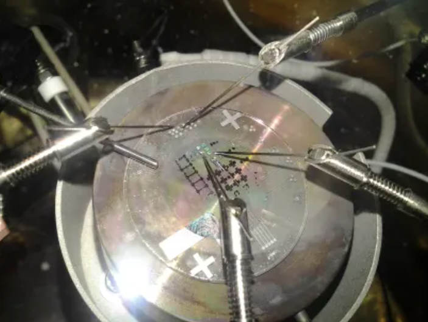
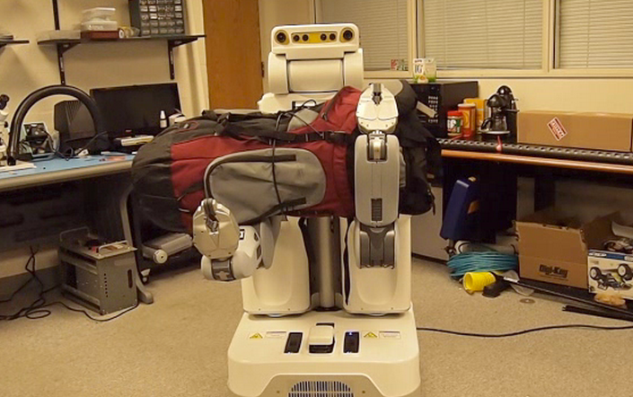
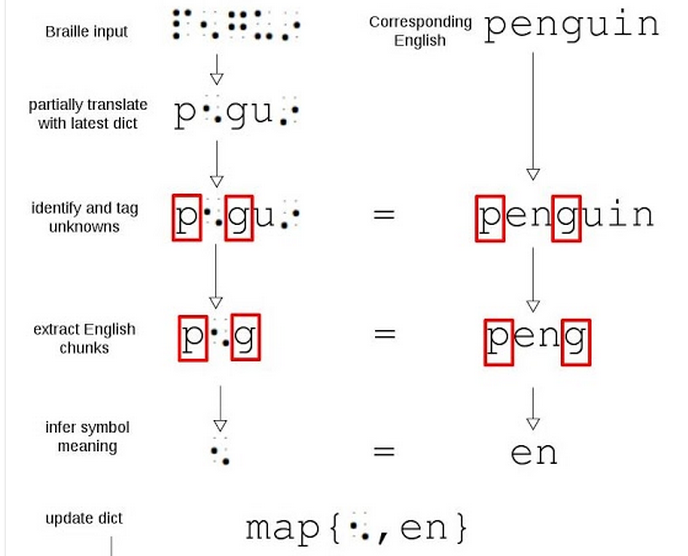
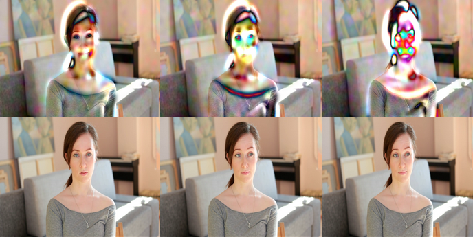
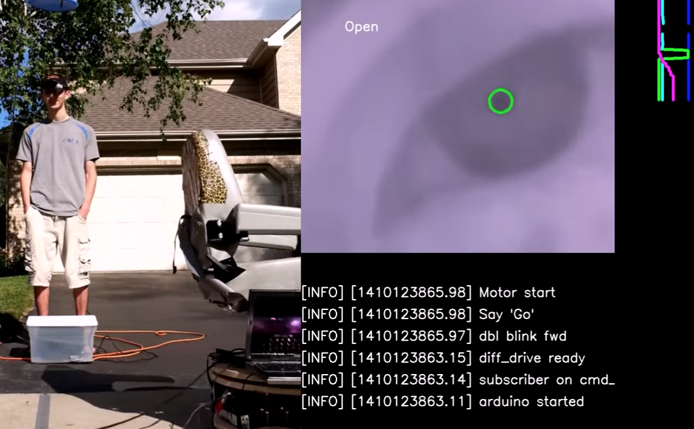

  

Before I was in math, I worked mostly in scientific simulation, autonomous robotics, and medical technology. I continue to work in chronic pain research. 

Here is a summary of my past non-math research and projects

  (In construction, can be viewed on my github).
   
  
  My first projects in robotics were in 2011: a dinky hexapod that autonomously followed people around, and Rubik's cube solving robot.
  
  In Spring 2012, I [became interested](http://rin.io/coupled-oscillator-love/) in physical examples of [nonlinear systems](http://rin.io/matlab-lorenz-attractor/) due to a [research project](http://thefutureofthings.com/4060-flexible-memristor-chips/) at the Chemistry and Physics Department of Mary Baldwin College, and modeled the resistant switching behavior of [flexible TiO2](http://books.google.com/books?id=Aey-h9lgcQgC&pg=PA111&lpg=PA111&dq=tio2+memristor+mary+baldwin&source=bl&ots=_Cxkt4ZyU8&sig=12ZG4phc_r1cNRkhmyg99YZ1dUc&hl=en&sa=X&ei=U0dcVN2RBdHToAT4u4LoDQ&ved=0CEMQ6AEwBQ#v=onepage&q=tio2%20memristor%20mary%20baldwin&f=false).

Summer 2012, the [Positronics Division of the George Washington University Robotics Lab](http://robotics.gwu.edu/positronics/?page_id=9) took me under their wing as an intern. Our team smoothed joint movement of the Willow Garage Personal Robot 2 (PR2), alongside improving load equalization (below). I [programmed the PR2](http://rin.io/semi-autonomous-robotics-2012-my-1st-software-project/) to autonomously "learn" to place objects in holes with the corresponding shape (using only past motor position commands and the finger gripper sensors).

[Source](http://robotics.gwu.edu/positronics/?p=59)

On the side, fascinated by the phenomena of producing argon plasma glow via the introduction of an RF source at 2.45GHz to a conductive cavity, I modeled the modes of conductive [polyhedra](http://en.wikipedia.org/wiki/Goldberg_polyhedron)[.](http://robotics.gwu.edu/positronics/?page_id=9)

After transferring to [GMU](http://rin.io/18-lessons/) Fall 2012, I extended their simulation for [predicting the material properties](http://rin.io/computational-materials-science/) of compound materials and explored [algorithms of AI chess players](http://rin.io/chess-engine/).

Spring 2013, an interest in contextual machine learning led me to write an [automated contextual analysis program](https://github.com/catherineray/CAMEL) that [learned the grammar rules of compressed Braille](http://rin.io/camel-paper/) from partially translated text. I used Braille as a test language, but this is a framework to automate the decoding of any partially understood (ancient) language by creating probabilistic dictionaries.\
[

Summer 2013, I interned as a software engineer at Cloudera. During my time there, I [developed a consumer download metrics tracking system for internal purposes](http://blog.cloudera.com/blog/2013/08/what-i-learned-during-my-summer-internship-at-cloudera/).

Fall 2013, I played with [SLAM and motion planning on the ARDrone](http://masc.cs.gmu.edu/wiki/DeformGroup). For HackMIT 2013, I collaborated with [Kartik Talwar](http://kartikt.com/) and [Spencer Hewett](http://www.skip.it/) to create a Google Glass application that [calculates the human pulse from the video feed](http://rin.io/hackmit-polyglass/).\
[

Early 2014, I briefly devoted my time to designing a keychain-sized food scanner [that detects gluten and other common food allergen proteins](http://rin.io/reframing-the-gluten-scanner/). From late 2013 to mid 2014, I dipped my toes into audio processing by automating the collection and classification of lab-animal vocalizations. Through this, I discovered that one can detect libido and stress change as early as preclinical trials.

Summer 2013-Spring 2014, I explored the improvement of mobility devices. A nonprovisional patent was submitted in Dec 2014 for the 5 pressure sore relief mechanisms that grew out of this. (I withdrew the patent once I decided to go into academia because I did not need to spend 5K on a design I wasn't going to use!)

Summer 2014, I became interested in neuroprosthetics. I started with the software side (convergence analysis of common decoder algorithms), and transitioned into playing with the hardware side ([optical recording methods](https://web.archive.org/web/20190213160322/http://rin.io/sensing-hardware/)).

Early 2015, I began mentoring Ada Rosa on mobility assistance for those with ALS and spinal chord injuries. [Here](https://www.youtube.com/watch?v=YJxgEDr699w) is a video of her showing off the eye control feature.

In January 2015, I was a [visiting researcher](https://web.archive.org/web/20190213160322/http://www.santafe.edu/gevent/detail/arrival/1962/) at the Santa Fe Institute, and gave a seminar on [Simplifying Multiscale Modeling](https://web.archive.org/web/20190213160322/http://www.santafe.edu/gevent/detail/science/1963/). I still think about applications of topology to multi-scale modeling, and occasionally venture to consider modeling complex systems of a biological nature with an eye toward [immunotherapy](https://web.archive.org/web/20190213160322/http://www.infoiasi.ro/bin/Annals/Article?v=XXIV1&a=2) and [neuroscience](https://web.archive.org/web/20190213160322/http://xxx.tau.ac.il/pdf/1410.8826.pdf).

I stopped keeping temporal notes of projects around 2015. Most of my extra curriculars post moving to math academia have been artistic or biological. 

I studied Russian from 2018-2020 and spent 4 months in Russia in 2019, the end of my trip was right at the beginning of Putin's violent crackdown on Moscow. 

I continue to do biological research on the side, especially around chronic pain and it's relationship to mental health. An overview of that work can be found here: [The Biome](https://rin.io/biome/)

Over the period of 2021-2023, I collaborated with Chris Orta to design and tattoo two massive full robot-skeleton snakes going from the top of my back to my mid calf. In the summer of 2023, I got heavily into street art graffiti, learning from my artistic collaborator Daniel Burnett: some samples of my graffiti work can be seen in the art section of my webpage. I have traveled around the U.S. and Europe making graffiti since.

In August 2023, I joined Chris Walker and a group of other fabulous artists to finish up and sail a boat made from a bouncy castle, which we lived on for a week.

My dear friend Petra Flurin and I wrote a comic together called Endomortis, more on that soon!

I am currently a [postdoc at Uni-Münster](https://www.uni-muenster.de/FB10srvi/persdb/MM-member.php?id=1772) in the Arithmetic and Homotopy Theory Working Group lead by [Thomas Nikolaus](https://www.uni-muenster.de/IVV5WS/WebHop/user/nikolaus/index.html) and [Christopher Deninger](https://en.wikipedia.org/wiki/Christopher_Deninger). Here's a recent interview I did as part of On a Tangent: Voices of Mathematics Muenster: [How an Inventor becomes a Mathematican](https://open.spotify.com/episode/6yw6nazYdvFW4lp24rolZd?si=kOzCIF7lQYeGPBlgWI-gjg).

Before that, I graduated from [George Mason University at 16](http://newsdesk.gmu.edu/2013/12/mason-celebrates-winter-graduates/) with a B.S. in Computational Physics, and accepted the [Thiel Fellowship](http://www.thielfellowship.org/about/about-the-fellowship/) in 2014 to develop medical technology and study mathematics under my mentor, [Edward Frenkel](http://www.edwardfrenkel.com/). I graduated with my Master's degree from UChicago working with [Peter May](http://www.math.uchicago.edu/~may/) and [Kazuya Kato (加藤 和也)](https://en.wikipedia.org/wiki/Kazuya_Kato), and with my PhD from Northwestern working with [Paul Goerss](https://sites.math.northwestern.edu/~pgoerss/). 

### Contact me

Curiosity is welcome: fractalcows@gmail.com

My work email: cray@uni-muenster.de

If you are interested in my research mathematics, a few fun papers are below. [Here](pdfs/application_general_audience.pdf) is a 4 page summary of my work as a graduate student for a general audience, including original illustrations.

You will find the name Catherine Ray on my old research papers and Rin Ray on my newer works, these both refer to the same person. I prefer Rin nowadays.

### Research publications:

- [Automorphisms of Abelian Varieties and Principal Polarizations](https://link.springer.com/article/10.1007/s12215-020-00590-7) joint with D. Lee; _Rendiconti del Circolo Matematico di Palermo Series 2, Volume 71, pages 483–494, 2022_ [arxiv](https://arxiv.org/abs/1811.07007)  
- [Towards Directed Collapsibility](https://link.springer.com/chapter/10.1007/978-3-030-42687-3_17) joint with R. Belton, R. Brooks, S. Ebli, L. Fajstrup, B. T. Fasy, N. Sanderson, E. Vidaurre; _Advances in Mathematical Sciences, Volume 21, pages 255–271, 2020_ [arxiv](https://arxiv.org/abs/1902.01039) 

### Research preprints:

- [Towards the \\( p=3 \\) Kervaire Invariant Problem: The \\( E_2 \\)-page for the homotopy fixed points spectral sequence computing \\(π_*(E_6^{hC9}) \\)](https://arxiv.org/abs/2507.10157) joint with Eva Belmont (July 2025)
- (Thesis Paper 1) [Modeling Group Actions on Stacks (Especially the Lubin-Tate Action)](https://arxiv.org/abs/2507.00309) (July 2025)
- [A Global Crystalline Period Map](https://arxiv.org/abs/1911.08615) joint with M. Neaton and A. Pieper (2018)

### In progress:

Zeta Functions in Homotopy Theory: 
- Riemann Roch for Rademeister Torsion in K-theory and L-Theory (Toward Categorifying the relationship of Symplectic L-functions and Rademeister Torsion)
- Syntomic cohomology of ring spectra and a \\( T(h) \\)-local zeta function; joint with Gabe Angelini-Knoll
- L-genera and Localizations in K-theory; joint with Daniel Berwick-Evans, Natalia Pacheco-Tallaj

- All Bernoulli Numbers in Homotopy Theory Are Shifts: Connecting Kevaire-Milnor to Quillen-Lichtenbaum using the compatibility of \\( K(\mathbb{S}) \\) and \\( L_{K(1)}K(\mathbb{Z}) \\) (on hiatus)

Jacquet-Langlands and Homotopy Theory: 
- Toward the Transchromatic Splitting Conjecture Via a Mod p-Two Tower Correspondence; joint with T. Barthel, L. Mann, T. Schlank, P.Srinivasan, J. Weinstein, Y. Xu, Z. Yang, X. Zhou.

Moduli Stacks of Curves in Homotopy Theory:
The group cohomology of the maximal finite subgroups of the Lubin-Tate action is the E_2 page needed to capture all p-torsion information in the stable homotopy groups of spheres, and the only nontrivial p-torsion for odd primes is found at heights $p^{k-1}(p-1)$. 

My thesis (from 2023) attempts to resolve a 40 year old conjecture describing the Lubin-Tate action for all maximal finite subgroups, in the process proividing a higher height alternative to tmf which does not use Shimura varieties.  A key insight is to replace the role of level structures with higher ramification information. To make the thesis more digestible, I have broken it up into 3 parts which are forthcoming.
- (Thesis Paper 2) Squirming Jewels: Moduli Stacks of G-Curves Model the Lubin-Tate Action for \\( h = p-1 \\)
- (Thesis Paper 3) Writhing Jewels: A Conjectural Description of the Lubin-Tate Action via Moduli Stacks of G-Curves for \\( h = p^{k-1}(p-1) \\)

- The Eigenvalues of Frobenius of Artin-Schreier-Witt Curves are Gauss Sums (New Families of Newton Strata in the Torelli Locus)  [Here's a note toward this: Using Automorphism Groups of Curves to Control the Slopes of their Jacobians](http://rin.io/pdfs/Gauss_sums.pdf) 

Old and likely dead:
- Covers of the Octahedron; joint with D. Lee 
- Duality resolutions for general linear groups; joint with E. Belmont, P. VanKoughnett

### Expository writing:

- [Zeta Functions and THH](pdfs/Zeta_Functions_and_THH_Talk3.pdf) July 16 2025
- [Using Automorphism Groups of Curves to Control the Slopes of their Jacobians](http://rin.io/pdfs/Gauss_sums.pdf) 

- (Coming Soon) K-theoretic Tate Poutou Duality Seminar (March 2025)

- [Geometry for Prime Addicts](https://rin.io/images/wp-content/uploads/2018/04/padicgeometry-1.pdf) Background on p-adic geometry toward proving the Monodromy Weight conjecture.
- [The Hecke Orbit Conjecture and Homotopy Theory](https://github.com/catherineray/catherineray.github.io/blob/master/pdfs/heckeorbitshomotopy_.pdf) Explaining that the stabilizer of the Hecke Action is the Morvava Stabilizer Group.
- [An Overview of the Classic Theory of P-Divisible Groups](/pdfs/officialober-1.pdf) (Published in Oberwolfach Proceedings)

- [Fiber Bundles of Formal Disks](/pdfs/formalgroup-1.pdf) (with A. Holeman)
- [A Complete Proof of the Polynomial Ham Sandwich Theorem, Based on Gromov’s Proof](/pdfs/gromovprooffill.pdf)

My two Master's theses
- [Calculating pi_*(tmf) at the prime 2](https://rin.io/images/wp-content/uploads/2017/05/a1-2.pdf) (An Illustrated Guide to the May Spectral Sequence)
- [Models of Formal Group Laws of Every Height](https://rin.io/images/wp-content/uploads/2017/08/lubintatemodels-2.pdf)
  

 
