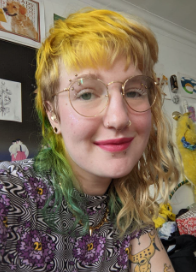
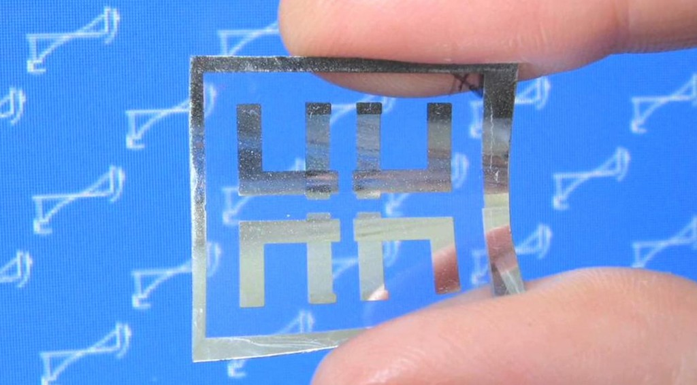

My name is Cathe**rin**e Ray (they/them), and I'm a mathematician. 

My current mathematical research is on arithmetic patterns in homotopy theory and physics. Before I was in math, I worked mostly in scientific simulation, autonomous robotics, and medical technology. I continue to work in chronic pain research and make lots of art! 

  
  
I graduated from [George Mason University at 16](http://newsdesk.gmu.edu/2013/12/mason-celebrates-winter-graduates/) with a B.S. in Computational Physics, and accepted the [Thiel Fellowship](http://www.thielfellowship.org/about/about-the-fellowship/) in 2014 to study mathematics full time under my mentor, [Edward Frenkel](http://www.edwardfrenkel.com/). I graduated with my Master's degree from UChicago working with [Peter May](http://www.math.uchicago.edu/~may/), and with my PhD from Northwestern working with Paul Goerss. I am currently a postdoc at Uni-Münster in the Arithmetic and Homotopy Theory Working Group lead by Thomas Nikolaus and Christopher Deninger.

[Here](pdfs/application_general_audience.pdf) is a summary of my work as a graduate student for a general audience, including original illustrations. 

  
Here is a summary of my past and present research.

  (Currently under construction, mind the mess). 
  
  My first projects in robotics were in 2011: a dinky hexapod that autonomously followed people around, and Rubik's cube solving robot.
  
  
  In Spring 2012, I [became interested](http://rin.io/coupled-oscillator-love/) in physical examples of [nonlinear systems](http://rin.io/matlab-lorenz-attractor/) due to a [research project](http://thefutureofthings.com/4060-flexible-memristor-chips/) at the Chemistry and Physics Department of Mary Baldwin College, and modeled the resistant switching behavior of [flexible TiO2](http://books.google.com/books?id=Aey-h9lgcQgC&pg=PA111&lpg=PA111&dq=tio2+memristor+mary+baldwin&source=bl&ots=_Cxkt4ZyU8&sig=12ZG4phc_r1cNRkhmyg99YZ1dUc&hl=en&sa=X&ei=U0dcVN2RBdHToAT4u4LoDQ&ved=0CEMQ6AEwBQ#v=onepage&q=tio2%20memristor%20mary%20baldwin&f=false).
  
  
  [Source](http://thefutureofthings.com/4060-flexible-memristor-chips/)
  
  Summer 2012, the [Positronics Division of the George Washington University Robotics Lab](http://robotics.gwu.edu/positronics/?page_id=9) took me under their wing as an intern. Our team smoothed joint movement of the Willow Garage Personal Robot 2 (PR2), alongside improving load equalization (below). I [programmed the PR2](http://rin.io/semi-autonomous-robotics-2012-my-1st-software-project/) to autonomously "learn" to place objects in holes with the corresponding shape (using only past motor position commands and the finger gripper sensors).
  
  On the side, fascinated by the phenomena of producing argon plasma glow via the introduction of an RF source at 2.45GHz to a conductive cavity, I modeled the modes of conductive [polyhedra](http://en.wikipedia.org/wiki/Goldberg_polyhedron)[.](http://robotics.gwu.edu/positronics/?page_id=9)
  
  
  [Source](http://robotics.gwu.edu/positronics/?p=59)

  On the side, fascinated by the phenomena of producing argon plasma glow via the introduction of an RF source at 2.45GHz to a conductive cavity, I modeled the modes of conductive [polyhedra](http://en.wikipedia.org/wiki/Goldberg_polyhedron).

### Contact me

Curiosity is welcome: fractalcows@gmail.com

My work email: cray@uni-muenster.de

If you are interested in my research mathematics, here are some fun papers of mine: 

### Research publications:

- [Automorphisms of Abelian Varieties and Principal Polarizations](https://link.springer.com/article/10.1007/s12215-020-00590-7) joint with D. Lee; _Rendiconti del Circolo Matematico di Palermo Series 2, Volume 71, pages 483–494, 2022_ [arxiv](https://arxiv.org/abs/1811.07007)  
- [Towards Directed Collapsibility](https://link.springer.com/chapter/10.1007/978-3-030-42687-3_17) joint with R. Belton, R. Brooks, S. Ebli, L. Fajstrup, B. T. Fasy, N. Sanderson, E. Vidaurre; _Advances in Mathematical Sciences, Volume 21, pages 255–271, 2020_ [arxiv](https://arxiv.org/abs/1902.01039) 

### Research preprints:

[A Global Crystalline Period Map](https://arxiv.org/abs/1911.08615) joint with M. Neaton and A. Pieper

### In progress:

- A Geometric Model of Higher K-theories at Height h=p^{k-1}(p-1) via Families of Ramified Curves — (my thesis, readable arxiv version in progress)
- The homotopy groups of E_6^{hC_9} and the odd primary Kevaire invariant; joint with E. Belmont
- Covers of the Octahedron; joint with D. Lee 
- Duality resolutions for general linear groups; joint with E. Belmont, P. VanKoughnett

### Expository writing:

- [Calculating pi_*(tmf) at the prime 2](https://people.math.rochester.edu/faculty/doug/otherpapers/ray-a1-2.pdf) (An Illustrated Guide to the May Spectral Sequence)
- [A Complete Proof of the Polynomial Ham Sandwich Theorem, Based on Gromov’s Proof](/pdfs/gromovprooffill.pdf)
- [Fiber Bundles of Formal Disks](/pdfs/formalgroup-1.pdf) (with A. Holeman)
- [An Overview of the Classic Theory of P-Divisible Groups](/pdfs/officialober-1.pdf) (Published in Oberwolfach Proceedings)
